# GAMES202

[TOC]

## 计算机动画
- 组成
    - 仿真: 可描述的
    - 角色动画：行为（仿真+控制：老师个人理解）
        - 人物
        - 动物
        - 机器
        - ...
### 角色动画
- 角色动画管线
    - 骨骼[Rigging] 和 角色蒙皮[skinning]
    - 骨骼动画[Skeletal Animation]
- 真实世界的运动
    1. 神经元兴奋
    2. 肌肉活动
    3. 肌肉骨骼系统上的力/扭矩
    4. 物理
    5. 身体姿势

- 前向运动学
    - 给定每个关节的旋转
    - 计算末端位置
- 逆向运动学
    - 给定末端执行器位置
    - 计算每个关节的旋转
- 关键帧动画
    - 动作捕捉
    - 动作重定向[Retargeting]
        - 可能大小比例不一样
        - 可能反关节
    - 状态机[State Machines]/Motion graphs
        - 通过状态机去记录每个动作的状态机切换
        - 缺点
            - 非常复杂
    - 动作匹配[Motion Matching]
        - 不是播放整个完整动作
        - 对动作进行切片，切片到每一帧
        - 每一帧结束以后，对最近的姿态进行搜索，满足动作需要
    - 基于遗传学方法， 利用深度学习
        - 两种方法
            - 学习方向与动作的关系
            - 动作生成模型
                - 学习速度快，成本低
        - 跨模态生成
            - 利用音乐生成动作
            - 利用一段语言生成动作
        - 局限
            - 会出现穿模、脚上打滑
            - 与环境有交互状态（难以采样到）
- 基于物理的方法
    - 关键帧动画
        - 多了一部，加入力的控制
    - 轨迹优化
    - 抽象模型
    - 强化学习
    - 基于DRL的跟踪控制
    - 分层控制器
    - 生成控制器

## 回顾线性代数
### 向量
- $\textbf{a}$, 粗体表示向量，向量既有大小也有方向
- 大小：$||\textbf{a}||$
- 方向：$\frac{\textbf{a}}{||\textbf{a}||}$
- 可以用来表示位置、速度
### 向量表示
- $\textbf{a} = (a_1, a_2, ... a_n)^T = \begin{bmatrix} a_1 \\ a_2 \\ ... \\ a_n \end{bmatrix}$
- 大小/长度：$||\textbf{a}||_2 = \sqrt{a_1^2+a_2^2+...+a_n^2}$
### 向量计算
- 向量相加
    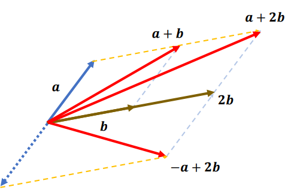
    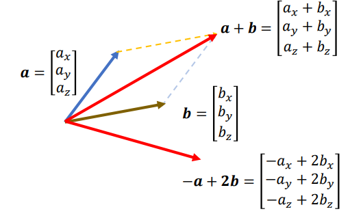
- 点乘
    - $\textbf{a}\cdot \textbf{b} = a_1b_1+a_2b_2+...+a_nb_n$
    - $\textbf{a}\cdot \textbf{b} = \textbf{b}\cdot \textbf{a}$
    - $\textbf{a}\cdot (\textbf{b} + \textbf{c}) =  \textbf{a}\cdot\textbf{b} +  \textbf{a}\cdot \textbf{c}$
    - $\textbf{a}\cdot \textbf{a} = a_1a_1+a_2a_2+...+a_na_n = ||a||_2^2$
    - 欧几里得距离
        - $\textbf{a}\cdot \textbf{b} = \|\textbf{a}\|\|\textbf{b}\|cos\theta$
        - $\theta = arccos \frac{\textbf{a}\cdot \textbf{b}}{\|\textbf{a}\|\|\textbf{b}\|}$
        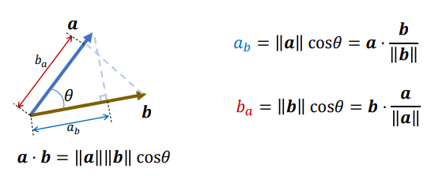
- 叉乘
    - $\textbf{c} = \textbf{a}\times \textbf{b} = \begin{bmatrix} a_yb_z - a_zb_y \\ a_zb_x - a_xb_z \\ a_xb_y - a_yb_x\end{bmatrix} = |\textbf{a}\|\|\textbf{b}\|sin(\theta)n$
    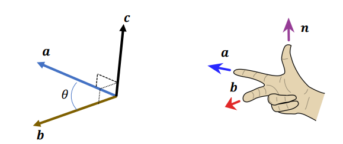
    - $\textbf{a}\times \textbf{b} = -\textbf{b}\times \textbf{a}$
    - $\textbf{a}\times (\textbf{b} + \textbf{d}) = \textbf{a}\times \textbf{b} + \textbf{a} \times \textbf{d}$
    - $\textbf{a}\times (\textbf{b} \times \textbf{c}) \neq (\textbf{a}\times \textbf{b}) \times \textbf{c}$
    - $\textbf{n} = \frac{\textbf{a}\times \textbf{b}}{\|\textbf{a x b}\|}$
    - 旋转
        - $\textbf{u} = \frac{\textbf{a}\times \textbf{b}}{\textbf{a}\times \textbf{b}}$
        - $\theta = arccos\frac{\textbf{a}\cdot \textbf{b}}{\|\textbf{a}\| \|\textbf{b}\|}$
        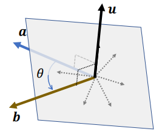
        - 对于方向
            - $\textbf{v} \leftarrow \textbf{u} \times \textbf{a}$
            - $\textbf{t} \leftarrow \textbf{u} \times \textbf{v} = \textbf{u} \times (\textbf{u} \times \textbf{a})$
            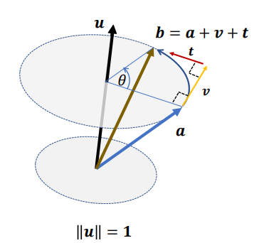
        - 对于长度
            - $\textbf{v} = (sin\theta)\textbf{u} \times \textbf{a}$
            - $\textbf{t} = (1 - cos\theta)\textbf{u} \times (\textbf{u} \times \textbf{a})$
            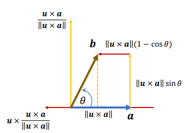
        - $\textbf{b} = \textbf{a} + (sin\theta)\textbf{u} \times \textbf{a} + (1 - cos\theta)\textbf{u} \times (\textbf{u} \times \textbf{a})$
#### 正交基 & 正交坐标
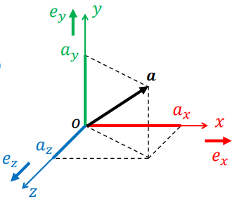

- $\textbf{a} = \begin{bmatrix} a_x \\ a_y \\ a_z \end{bmatrix} \in \mathbb{R}^3$
- $\|\textbf{e}_x\| = \|\textbf{e}_y\| = \|\textbf{e}_z\| = 1$
- $\textbf{e}_x\cdot \textbf{e}_y = \textbf{e}_y \cdot \textbf{e}_z = \textbf{e}_z \cdot \textbf{e}_x =0$
- $\textbf{e}_x \times \textbf{e}_y = \textbf{e}_z$
  $\textbf{e}_y \times \textbf{e}_z = \textbf{e}_x$
  $\textbf{e}_z \times \textbf{e}_x = \textbf{e}_y$
- $\textbf{a} = a_x \textbf{e}_x + a_y \textbf{e}_y + a_z \textbf{e}_z$
- $\begin{aligned}\textbf{a} \cdot \textbf{b} &= (a_x \textbf{e}_x + a_y \textbf{e}_y + a_z \textbf{e}_z) \cdot (b_x \textbf{e}_x + b_y \textbf{e}_y + b_z \textbf{e}_z)\\ &= a_xb_x\textbf{e}_x\cdot \textbf{e}_x + a_yb_y\textbf{e}_y\cdot \textbf{e}_y + a_zb_z\textbf{e}_z\cdot \textbf{e}_z + \sum_{i\neq j} a_ib_j\textbf{e}_i\cdot \textbf{e}_j \\\end{aligned}$ 
    - $\because$最后一项等于0，因为是正交的
    - $\therefore \begin{aligned}\textbf{a} \cdot \textbf{b} &= (a_x \textbf{e}_x + a_y \textbf{e}_y + a_z \textbf{e}_z) \cdot (b_x \textbf{e}_x + b_y \textbf{e}_y + b_z \textbf{e}_z)\\ &= a_xb_x\textbf{e}_x\cdot \textbf{e}_x + a_yb_y\textbf{e}_y\cdot \textbf{e}_y + a_zb_z\textbf{e}_z\cdot \textbf{e}_z\\\end{aligned}$
- $\begin{aligned}\textbf{a} \times \textbf{b} &= (a_x \textbf{e}_x + a_y \textbf{e}_y + a_z \textbf{e}_z) \times (b_x \textbf{e}_x + b_y \textbf{e}_y + b_z \textbf{e}_z)\\ &= a_xb_x\textbf{e}_x\times \textbf{e}_x + a_xb_y\textbf{e}_x\times \textbf{e}_y + a_xb_z\textbf{e}_x\times \textbf{e}_z\\ &+ a_yb_x\textbf{e}_y\times \textbf{e}_x + a_yb_y\textbf{e}_y\times \textbf{e}_y + a_yb_z\textbf{e}_y\times \textbf{e}_z\\ &+ a_zb_x\textbf{e}_z\times \textbf{e}_x + a_zb_y\textbf{e}_z\times \textbf{e}_y + a_zb_z\textbf{e}_z\times \textbf{e}_z\\\end{aligned}$
    - 自己叉乘等于0 和 $\textbf{a}\times \textbf{b} = -\textbf{b}\times \textbf{a}$
    - $\begin{aligned}\textbf{a} \times \textbf{b} &= (a_yb_z - a_zb_y)\textbf{e}_x\\ &+ (a_zb_x - a_xb_z)\textbf{e}_y\\ &+ (a_xb_y - a_yb_x)\textbf{e}_z\\\end{aligned}$
### 矩阵
- $\begin{aligned}\textbf{A} &= \begin{bmatrix} a_{11} & a_{12} & a_{13} \\ a_{21} & a_{22} & a_{23} \\ a_{31} & a_{32} & a_{33} \\\end{bmatrix} \in \mathbb{R}^{3\times3}\\ &=[\textbf{a}_1 \quad \textbf{a}_2 \quad \textbf{a}_3] \\ &= \begin{bmatrix} \textbf{a}_1*\\ \textbf{a}_2*\\ \textbf{a}_3*\\\end{bmatrix} \end{aligned}$
- 特殊矩阵
    - 单位矩阵： $I = \begin{bmatrix} 1 & 0 & 0\\ 0 & 1 & 0\\ 0 & 0 & 1 \end{bmatrix}$ 
    - 对角阵：$\begin{bmatrix} a_1 & 0 & 0\\ 0 & a_2 & 0\\ 0 & 0 & a_3 \end{bmatrix}$ 
    - 对称矩阵：$\begin{bmatrix} a & d & e\\ d & b & f\\ e & f & c \end{bmatrix}$ 
    - 反对称矩阵：$\begin{bmatrix} 0 & -a & b\\ a & 0 & -c\\ -b & c & 0 \end{bmatrix}$ 
- 转置矩阵
    - $\begin{aligned}\textbf{A}^T &= \begin{bmatrix} a_{11} & a_{21} & a_{31} \\ a_{12} & a_{22} & a_{32} \\ a_{13} & a_{23} & a_{33} \\\end{bmatrix} \in \mathbb{R}^{3\times3}\\ &=[\textbf{a}_1^T \quad \textbf{a}_2^T \quad \textbf{a}_3^T] \\ &= \begin{bmatrix} \textbf{a}_{1*}^T\\ \textbf{a}_{2*}^T\\ \textbf{a}_{3*}^T\\\end{bmatrix} \end{aligned}$
- 标量乘法
    - $s\textbf{A}=\begin{bmatrix} sa_{11} & sa_{12} & sa_{13} \\ sa_{21} & sa_{22} & sa_{23} \\ sa_{31} & sa_{32} & sa_{33} \\\end{bmatrix}$
- 加法
    - $\textbf{A} + \textbf{B} = \begin{bmatrix} a_{11} + b_{11} & a_{12} + b_{12} & a_{13} + b_{13} \\ a_{21} + b_{21} & a_{22} + b_{22} & a_{23} + b_{23} \\ a_{31} + b_{31} & a_{32} + b_{32} & a_{33} + b_{33} \\\end{bmatrix}$
- 矩阵乘法
    - $\textbf{C}=\textbf{A}\textbf{B} = \begin{bmatrix} a_{11} & a_{12} & a_{13} \\ a_{21} & a_{22} & a_{23} \\ a_{31} & a_{32} & a_{33} \\\end{bmatrix}\begin{bmatrix} b_{11} & b_{12} & b_{13} \\ b_{21} & b_{22} & b_{23} \\ b_{31} & b_{32} & b_{33} \\\end{bmatrix} = \begin{bmatrix} a_{11}b_{11}+a_{12}b_{21}+a_{13}b_{31} & * & * \\ * & * & * \\ * & * & * \\\end{bmatrix} = [c_{ij} = \textbf{a}_{i*}\cdot b_j]$
    - $\textbf{A}\textbf{B} \neq \textbf{B}\textbf{A}$
    - $\textbf{A}\textbf{B}\textbf{C} = (\textbf{A}\textbf{B})\textbf{C} = \textbf{A}(\textbf{B}\textbf{C})$
    - $\textbf{A}(\textbf{B}+\textbf{C})=\textbf{A}\textbf{B}+\textbf{A}\textbf{C}$
    - $(\textbf{A}\textbf{B})^T=\textbf{B}^T\textbf{A}^T$
- 矩阵的逆
    - $\textbf{M}=\textbf{A}^{-1}\Leftrightarrow \textbf{M}\textbf{A} = \textbf{A}\textbf{M} = I$
    - $(\textbf{A}\textbf{B})^{-1} = \textbf{B}^{-1}\textbf{A}^{-1}$
- 点乘（另外写法）
    - $\begin{aligned}\textbf{a}\cdot \textbf{b} &= a_xb_x+a_yb_y+a_zb_z \\ &= \textbf{a}^T\textbf{b}=\begin{bmatrix} a_x & a_y & a_z\end{bmatrix}\begin{bmatrix} b_x \\ b_y \\ b_z\end{bmatrix} \\ &= \textbf{b}^T\textbf{a}\end{aligned}$
- 叉乘（另外写法）
    - $\begin{aligned}\textbf{c} = \textbf{a}\times \textbf{b} &= \begin{bmatrix} a_yb_z - a_zb_y \\ a_zb_x - a_xb_z \\ a_xb_y - a_yb_x\end{bmatrix} \\ &= \begin{bmatrix}0 & -a_z & a_y \\ a_z & 0 & -a_x \\ -a_y & a_x & 0\end{bmatrix}\begin{bmatrix}b_x\\ b_y\\ b_z\end{bmatrix} = [\textbf{a}]_x\textbf{b}\end{aligned}$
    - $[\textbf{a}]_x + [\textbf{a}]_x^T = 0$
    - $\textbf{a}\times \textbf{b} = [\textbf{a}]_x\textbf{b}$
    - $\begin{aligned}\textbf{a}\times (\textbf{b} \times \textbf{c}) &= [\textbf{a}]_x([\textbf{b}]_x\textbf{c})\\ &= [\textbf{a}]_x[\textbf{b}]_x\textbf{c}\end{aligned}$
    - $\textbf{a}\times (\textbf{a} \times \textbf{b}) = [\textbf{a}]_x^2\textbf{b}$
    - $(\textbf{a}\times \textbf{b}) \times \textbf{c} = [\textbf{a x b}]_x\textbf{c}$
    
    - $\begin{aligned}\textbf{b} &= \textbf{a} + (sin\theta)\textbf{u} \times \textbf{a} + (1 - cos\theta)\textbf{u} \times (\textbf{u} \times \textbf{a})\\ &=(\textbf{I} + (sin\theta)[\textbf{u}]_x + (1 - cos\theta)[\textbf{u}]_x^2)\textbf{a}\\ &=R\textbf{a} \end{aligned}$
        - Rodrigues' rotation formula: $R=\textbf{I} + (sin\theta)[\textbf{u}]_x + (1 - cos\theta)[\textbf{u}]_x^2$
- 正交矩阵
    - $\textbf{A}^T=\textbf{A}^{-1}$
    - $\textbf{A} = \begin{bmatrix} \textbf{a}_1 & \textbf{a}_2 & \textbf{a}_3 \end{bmatrix}$ &nbsp;&nbsp; $\textbf{a}_i^T\textbf{a}_j= \left\{\begin{aligned}1, if \ i = j \\0, if\ i \neq j\end{aligned}\right.$ 
    - $\textbf{A}^T\textbf{A} = \begin{bmatrix}\textbf{a}_1^T \\ \textbf{a}_2^T \\ \textbf{a}_3^T\end{bmatrix}\begin{bmatrix}\textbf{a}_1 & \textbf{a}_2 & \textbf{a}_3\end{bmatrix} = \begin{bmatrix}\textbf{a}_1^T\textbf{a}_1 & \textbf{a}_1^T\textbf{a}_2 & \textbf{a}_1^T\textbf{a}_3\\ \textbf{a}_2^T\textbf{a}_1 & \textbf{a}_2^T\textbf{a}_2 & \textbf{a}_2^T\textbf{a}_3\\ \textbf{a}_3^T\textbf{a}_1 & \textbf{a}_3^T\textbf{a}_2 & \textbf{a}_3^T\textbf{a}_3\\\end{bmatrix} = I$
- 行列式
    
    - $det\textbf{I}=1$
    - $det\textbf{A}\textbf{B}=det\textbf{A}*det\textbf{B}$
    - $det\textbf{A}^T=det\textbf{A}$
    - 如果$\textbf{A}$是可逆的，$det\textbf{A}^{-1} = (det\textbf{A})^{-1}$
    - 如果$\textbf{U}$是正交的，$det\textbf{U}=\pm1$，正负取决于向量方向，右手定则正，否则负
    - 叉乘（行列式表示）
        - $\begin{aligned}\textbf{c} &= \textbf{a}\times \textbf{b} = \begin{bmatrix} a_yb_z - a_zb_y \\ a_zb_x - a_xb_z \\ a_xb_y - a_yb_x\end{bmatrix}\\ &= det\begin{bmatrix}i & j & k\\ a_x & a_y & a_z \\ b_x & b_y & b_z\\\end{bmatrix}\end{aligned}$
- 特征值和特征向量
    - 对于矩阵 $\textbf{A}$, 如果满足 $\textbf{A}\textbf{x} = \lambda\textbf{x}$, $\textbf{x}$非零
        - $\lambda$ 为 $\textbf{A}$ 的特征值
        - $\textbf{x}$ 为 $\textbf{A}$ 的特征向量
        - 对于一个奇数阶的正交阵，至少有一个实数特征值：$\lambda = det \textbf{U} = \pm 1$

### 变换
- 缩放
    - $\textbf{a} = \begin{bmatrix} x\\ y\\ z\end{bmatrix}$
    - $\textbf{a'} = \begin{bmatrix} x'\\ y'\\ z'\end{bmatrix} = \begin{bmatrix}s_x*x\\ s_y*y\\ s_z*z\end{bmatrix}$
    - $\textbf{a'} = \begin{bmatrix}s_x & & \\ & s_y & \\ & & s_z\end{bmatrix}\textbf{a}$
- 平移
    - $\textbf{a'} = \textbf{a} + \textbf{t}$
- 旋转
    - $\textbf{a'} = \textbf{R}\textbf{a}$  
    - 旋转矩阵是正交的
        - $\textbf{R}^{-1} = \textbf{R}^T$
        - $\textbf{R}^T\textbf{R} = \textbf{R}\textbf{R}^T = \textbf{I}$
    - 行列式
        - $det \textbf{R}=+1$
    - 旋转保留向量长度
        - $\|\textbf{R}\textbf{x}\|=\|\textbf{x}\|$
    - 对于多个旋转
        - $\textbf{R}=\textbf{R}_2\textbf{R}_1$
        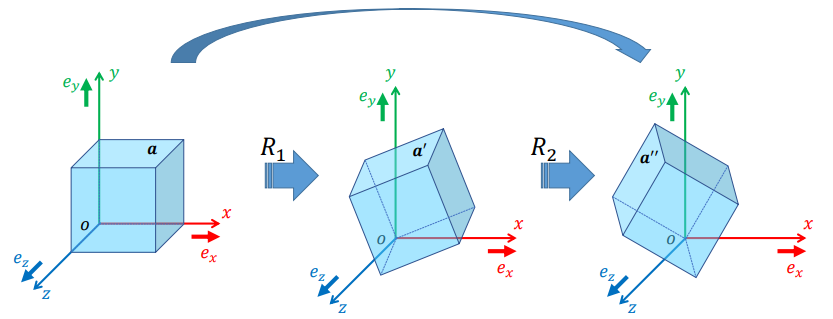
    - 不同轴的旋转
        - $\textbf{R}_x(\alpha)=\begin{pmatrix} 1 & 0 & 0 \\ 0 & cos\alpha & -sin\alpha \\ 0 & sin\alpha & cos\alpha \\\end{pmatrix}$
        - $\textbf{R}_y(\beta)=\begin{pmatrix} cos\beta & 0 & sin\beta \\ 0 & 0 & 1 \\ -sin\beta & 0 & cos\alpha \\\end{pmatrix}$
        - $\textbf{R}_z(\gamma)=\begin{pmatrix} cos\gamma & -sin\gamma & 0 \\ sin\alpha & cos\gamma & 0 \\ 0 & 0 & 1 \\\end{pmatrix}$
        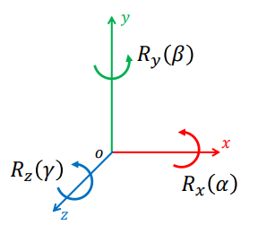
    - 寻找旋转轴和旋转角度
        - 在多次旋转后，可以简化成单次旋转
        - 旋转矩阵有一个实数特征向量：+1
            - $\textbf{R}\textbf{u} = \textbf{u}$
            - 对于旋转轴为对应特征向量+1的特征矩阵
        - 求旋转轴和旋转角度 
            - $\textbf{R}\textbf{u} = \textbf{u} \Rightarrow \textbf{u} = \textbf{R}^T\textbf{u}$ 因为旋转矩阵是正交的，逆等于转置矩阵，所以可以两边乘上$\textbf{R}^T$得到右边的公式
            - $(\textbf{R}-\textbf{R}^T)\textbf{u}=0$
            - $\begin{bmatrix} 0 & -(r_{21}-r_{12}) & r_{13}-r_{31} \\ r_{21}-r_{12} & 0 & -(r_{32}-r_{23}) \\ -(r_{13}-r_{31}) & r_{32}-r_{23} & 0  \end{bmatrix}\textbf{u} = 0$
            - $\textbf{u'} \times \textbf{u} = 0$ $\textbf{u}$不为0，如果$\textbf{u'}$不为0，两个则为同方向
            - $\textbf{u} \leftarrow \textbf{u'}=\begin{bmatrix} r_{32}-r_{23} \\   r_{13}-r_{31} \\ r_{21}-r_{12}\\\end{bmatrix}$ when $\textbf{R} \neq \textbf{R}^T \Leftrightarrow sin\theta \neq 0 \Leftrightarrow \theta \neq 0^\circ or 180^\circ$
            - 结论也可以从前面罗德里格Rodrigues公式得到：$R=\textbf{I} + (sin\theta)[\textbf{u}]_x + (1 - cos\theta)[\textbf{u}]_x^2$
                - $\|\textbf{u'}\|=2sin\theta$
    - 坐标轴转换
        
        - $(x', y', z')^T$ 为 $\textbf{a}$ 的局部系统坐标
        - $(x, y, z)^T$ 为 $\textbf{a}$ 的全局系统坐标
        - $\begin{aligned}\textbf{a}&=\begin{bmatrix} | & | & | \\ \textbf{e}_x & \textbf{e}_y & \textbf{e}_z \\ | & | & | \\ \end{bmatrix}\begin{bmatrix}x\\ y\\ z\end{bmatrix}\\ &= \begin{bmatrix} | & | & | \\ \textbf{e'}_x & \textbf{e'}_y & \textbf{e'}_z \\ | & | & | \\ \end{bmatrix}\begin{bmatrix}x'\\ y'\\ z'\end{bmatrix}\end{aligned}$ 竖线是省流，e为3x1矩阵
        - $\textbf{R}=\begin{bmatrix} | & | & | \\ \textbf{e}_x & \textbf{e}_y & \textbf{e}_z \\ | & | & | \\ \end{bmatrix}^{-1}\begin{bmatrix} | & | & | \\ \textbf{e'}_x & \textbf{e'}_y & \textbf{e'}_z \\ | & | & | \\ \end{bmatrix}$
        - $\begin{bmatrix}x\\ y\\ z\end{bmatrix} = \textbf{R}\begin{bmatrix}x'\\ y'\\ z'\end{bmatrix}$
        - 加入平移
            - object $\rightarrow$ global: $\begin{bmatrix}x\\ y\\ z\end{bmatrix} = \textbf{R}\begin{bmatrix}x'\\ y'\\ z'\end{bmatrix}+\textbf{t}$
            - global $\rightarrow$ object: $\begin{bmatrix}x'\\ y'\\ z'\end{bmatrix} = \textbf{R}^T(\begin{bmatrix}x\\ y\\ z\end{bmatrix}-\textbf{t})$
    - 三维旋转
        - 旋转参数化
            - $\textbf{R}=\begin{bmatrix} a_{11} & a_{12} & a_{13} \\ a_{21} & a_{22} & a_{23} \\ a_{31} & a_{32} & a_{33} \\\end{bmatrix}$
            - 因为旋转矩阵是正交矩阵，$\textbf{R}^T\textbf{R}=I$
            - 可以得到
                - $\left\{\begin{aligned}a_{11}^2+a_{12}^2+a_{13}^2=1\\ a_{12}^2+a_{22}^2+a_{23}^2=1\\ a_{32}^2+a_{32}^2+a_{33}^2=1 \end{aligned}\right.$
                - $\left\{\begin{aligned}a_{11}a_{12}+a_{21}a_{22}+a_{31}a_{32}=0\\ a_{11}a_{13}+a_{21}a_{23}+a_{31}a_{33}=0\\ a_{12}a_{13}+a_{22}a_{23}+a_{32}a_{33}=0 \end{aligned}\right.$
            - 所以有六个参数跟别的参数有关联，只要三个参数就能描述一个物体（degrees of freedom）
    - 移动插值
        - 对于平移：$\textbf{x}_t = (1-t)\textbf{x}_0+t\textbf{x}_1$
            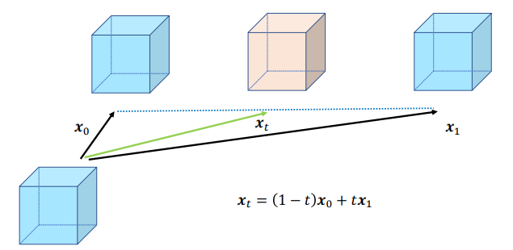
        - 对于旋转：
            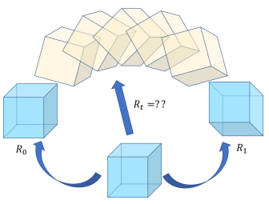
            - $\textbf{R}_t = (1-t)\textbf{R}_0+t\textbf{R}_1$ 这是错误的
            - $\textbf{R}_0 = \textbf{R}_y(-90^\circ)=\begin{bmatrix} 0 & 0 & 1\\ 0 & 1 & 0 \\ -1 & 0 & 0 \\ \end{bmatrix}$
            - $\textbf{R}_1 = \textbf{R}_y(+90^\circ)=\begin{bmatrix} 0 & 0 & -1\\ 0 & 1 & 0 \\ 1 & 0 & 0 \\ \end{bmatrix}$
            - $\textbf{R}_{0.5} = 0.5(\textbf{R}_0 + \textbf{R}_1)=\begin{bmatrix} 0 & 0 & 0\\ 0 & 1 & 0 \\ 0 & 0 & 0 \\ \end{bmatrix}$
            - x轴与z轴缩放到0，改变了物体原本形状，并不是正交的，所以线性插值是不行的
            - 对于旋转矩阵来说，**很难构造**， **方便应用**， **很难插值**
    - 欧拉角
        - 对于任何一个旋转，都能表示成三个基本旋转的乘积
        - XYZ, XZY, YZX, YXZ, ZYX, ZXY, XYX, XZX, YXY, YZY, ZXZ, ZYZ，这12种旋转方式
        - 两种约定
            - 内在[intrinsic]旋转: 在对象上附加轴
                - 对于X-Y-Z顺序的旋转，旋转矩阵为 $\textbf{R}_x(\alpha)\textbf{R}_y(\beta)\textbf{R}_z(\gamma)$
            - 外在[extrinsic]旋转: 在世界中固定轴
                 - 对于X-Y-Z顺序的旋转，旋转矩阵为 $\textbf{R}_z(\gamma)\textbf{R}_y(\beta)\textbf{R}_x(\alpha)$
        - 万向锁：在局部轴的特殊情况，可能导致两个轴重合/共线，导致两个旋转方向一致
            - 为什么会有这种情况？
                - 在旋转过程中，我们应当看做变换，没有过程。先转的轴会带动后转的轴进行移动，后转的轴不会带动先转的轴，与初始状态去对应。
                - 从代数角度理解
                    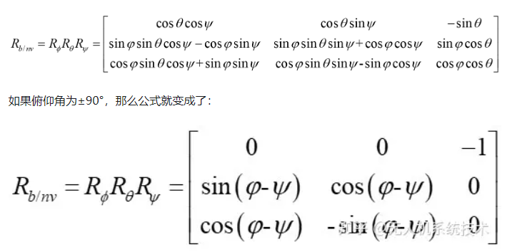
                    - [https://zhuanlan.zhihu.com/p/74040465](https://zhuanlan.zhihu.com/p/74040465)
        - 对于欧拉角来说，**方便构造**， **方便应用**， **方便插值**，但会有**万向锁**
    - 轴角表示
        - $(\textbf{u}, \theta)$
            - 旋转轴，向量$\textbf{u}$
            - 旋转向量， 标量$\theta$
        - 进一步：
            - **$\theta$** $= \theta\textbf{u}$
            - $\theta=\|\theta\|$
            - $\textbf{u}=\frac{\theta}{\|\theta\|}$
        - 旋转的时候：
            - $\textbf{x'}=\textbf{x}+(sin\theta)\textbf{u}\times\textbf{x}+(1-cos\theta)\textbf{u}\times(\textbf{u}\times\textbf{x})$
        - 轴角表示的线性插值
            - **$\theta_t$** $=(1-t)$**$\theta_0$**$+t$**$\theta_1$**
            - 变化非线性（证明复杂）
        - 如果要表示旋转速度恒定
            1. $R(\delta$**$\theta$**$)=R^T($**$\theta$**$_0)R($**$\theta$**$_1)$ 利用旋转矩阵，计算两个旋转的差值
            2. $\delta$**$\theta_t$**$=(1-t)0+t\delta$**$\theta$**, 在0和旋转之间做线性插值
            3. $R($**$\theta_t$**$)=R^T($**$\theta$**$_0)R(\delta$**$\theta_t$**$)$
        - 对于轴角表示来说，**方便构造**， **方便插值**，**不会有万向锁**，但**不好应用**，需要转换成旋转矩阵
    - 四元数
        - 欧拉公式： $e^{i\theta}=lim_{n\rightarrow \infty}(1+\frac{i\theta}{n})^n=cos(\theta)+isin(\theta)$
        - 对于二维旋转，可以很容易将一个向量表示成一个复数，并进行旋转，即
            - $\textbf{z}=a+bi=re^{i\theta}\in \mathbb{C}$ r为长度
            - $\begin{aligned}\textbf{z'}&=re^{i(\theta+\alpha)}\\&=e^{i\alpha}\times re^{i\theta}\\&=e^{i\alpha}\textbf{z}\end{aligned}$
        - 四元数: $\textbf{q}=a+bi+cj+dk\in\mathbb{H}$ $\mathbb{H}$ 为哈密顿空间
            - $a, b, c, d \in \mathbb{R}$
            - $i^2=j^2=k^2=ijk=-1$
            - $i\ne jk, j\ne ki, k\ne ij$
            - $ij = k, ji=-k$ (类似叉乘)
            - $jk = i, kj=-i$
            - $ji = j, ik=-j$
        - 四元数运算
            - 共轭[Conjugation]: $\textbf{q*}=a-bi-cj-dk$
            - 标量乘法: $t\textbf{q}=ta+tbi+tcj+tdk$
            - 加法: $\textbf{q}——1+\textbf{q}_2=(a_1+a_2)+(b_1+b_2)i+(c_1+c_2)j+(d_1+d_2)k$
            - 点乘: $\textbf{q}_1\cdot\textbf{q2}=a_1a_2+b_1b_2+c_1c_2+d_1d_2$
            - 范数(模长): $\|\textbf{q}\| = \sqrt{a^2+b^2+c^2+d^2}=\sqrt{\textbf{q}\cdot \textbf{q}}$
            - 乘法：$\begin{aligned}\textbf{q}_1\textbf{q}_2&=(a_1+b_1i+c_1j+d_1k)*(a_2+b_2i+c_2j+d_2k)\\&=a_1a_2-b_1b_2-c_1c_2-d_1d_2\\&+(b_1a_2+a_1b_2-d_1c_2+c_1d_2)i\\&+(c_1a_2+d_1b_2+a_1c_2-b_1d_2)j\\&+(d_1a_2-c_1b_2+b_1c_2+a_1d_2)k\\\end{aligned}$
        - 简写
            - $\textbf{q}=\begin{bmatrix} \omega \\ x \\ y \\ z \end{bmatrix} = \begin{bmatrix} \omega \\ v \end{bmatrix}$
            - $\textbf{q} = [\omega, \textbf{v}]^T, \omega \in \mathbb{R}, \textbf{v} \in \mathbb{R}^3$
            - $\omega = [\omega, \textbf{0}]^T$： 标量四元数
            - $\textbf{q} = [0, \textbf{v}]^T$: 纯四元数
        - 四元数运算（简写后）
            - 共轭[Conjugation]: $\textbf{q*}=[\omega, -\textbf{v}]^T$
            - 标量乘法: $t\textbf{q}=[t\omega, t\textbf{v}]^T$
            - 加法: $\textbf{q}_1+\textbf{q}_2=[\omega_1+\omega_2, \textbf{v}_1+\textbf{v}_2]^T$
            - 点乘: $\textbf{q}_1\cdot\textbf{q}_2=\omega_1\omega_2+\textbf{v}_1\cdot\textbf{v}_2$
            - 范数(模长): $\|\textbf{q}\| = \sqrt{\omega_1\omega_2+\textbf{v}_1\cdot\textbf{v}_2} = \sqrt{\textbf{q}\cdot \textbf{q}}$
            - 乘法：$\textbf{q}_1\textbf{q}_2=\begin{bmatrix}\omega_1 \\ \textbf{v}_1\end{bmatrix}\begin{bmatrix}\omega_2 \\ \textbf{v}_2\end{bmatrix} = \begin{bmatrix}\omega_1\omega_2-\textbf{v}_1\cdot\textbf{v}_2 \\ \omega_1\textbf{v}_2+ \omega_2\textbf{v}_1 + \textbf{v}_1\times \textbf{v}_2\end{bmatrix}$
        - 四元数性质：
            - 不满足交换律: $\textbf{q}_1\textbf{q}_2 \neq \textbf{q}_2\textbf{q}_1$
            - 瞒住结合律: $\textbf{q}_1\textbf{q}_2\textbf{q}_3=(\textbf{q}_1\textbf{q}_2)\textbf{q}_3=\textbf{q}_1(\textbf{q}_2\textbf{q}_3)$
            - 共轭 $(\textbf{q}_1\textbf{q}_2)^*=\textbf{q}_2^*\textbf{q}_1^*$
            - 范数(模长): $\|\textbf{q}\|^2=\textbf{q}^*\textbf{q}=\textbf{q}\textbf{q}^*$
            - 逆: 
                - $\textbf{q}\textbf{q}^{-1}=1 \Rightarrow \textbf{q}^{-1} = \frac{\textbf{q}^*}{\|\textbf{q}\|^2}$
                - $\textbf{q}^{-1}\textbf{q}=1$
                - 对于一个单位四元素
                    - $\textbf{q}^{-1}=\textbf{q}^*\Leftrightarrow \textbf{R}^{-1}=\textbf{R}^T$
        - 对于单位四元数，写作（可以想一下欧拉公式）
            - $\textbf{q}=\begin{bmatrix}\omega \\ \textbf{v}\end{bmatrix}[cos\frac{\theta}{2},\textbf{u}sin\frac{\theta}{2}]$, $\|\textbf{u}\|=1$
            - 角度：$\theta = 2arccos\omega$
            - 轴：$\textbf{u}=\frac{\textbf{v}}{\|\textbf{x}\|}$
        - 利用四元数旋转
            - $\begin{bmatrix} 0 \\ \textbf{p'} \end{bmatrix} = \textbf{q}\begin{bmatrix} 0 \\ \textbf{p} \end{bmatrix}\textbf{q*}=(-\textbf{q})\begin{bmatrix} 0 \\ \textbf{p'} \end{bmatrix}(-\textbf{q})^*$
            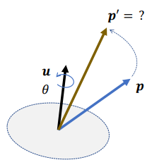
            - 对于两个旋转（单位四元数）$\textbf{q}_1, \textbf{q}_2$:
                - 对于向量 $\textbf{p}$
                    - $\begin{bmatrix} 0 \\ \textbf{p'} \end{bmatrix} = \textbf{q}_1\begin{bmatrix} 0 \\ \textbf{p} \end{bmatrix}\textbf{q}_1^*$
                    - $\begin{bmatrix} 0 \\ \textbf{p''} \end{bmatrix} = \textbf{q}_2\begin{bmatrix} 0 \\ \textbf{p'} \end{bmatrix}\textbf{q}_2^* = \textbf{q}_2(\textbf{q}_1\begin{bmatrix} 0 \\ \textbf{p} \end{bmatrix}\textbf{q}_1^*)\textbf{q}_2^*=(\textbf{q}_2\textbf{q}_1)\begin{bmatrix} 0 \\ \textbf{p} \end{bmatrix}(\textbf{q}_2\textbf{q}_1)^*$
                - 合并旋转: $\textbf{q} = \textbf{q}_2\textbf{q}_1$
            - 旋转过程:
                - 线性插值
                    - $\textbf{q}_t=(1-t)\textbf{q}_0+t\textbf{q}_1$
                    - 将上述公式的 $\textbf{q}_t$ 进行归一化处理，使得其从两点间线段移动变成在圆弧上移动
                        - $\tilde{\textbf{q}}_t=(1-t)\textbf{q}_0+t\textbf{q}_1$
                        - $\textbf{q}_t = \frac{\tilde{\textbf{q}}_t}{\|\tilde{\textbf{q}}_t\|}$
                        - 但这个速度是**不恒定**的，但是其实问题不是很大，因为线性插值都不会插很远
                        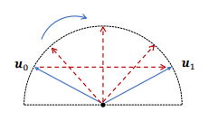
                - SLERP[Spherical Linear Interpolation]:
                    - 为了能得到均匀速度
                        - 引入两个函数，动态的去改变比例
                        - $\textbf{q}_t=a(t)\textbf{q}_0+b(t)\textbf{q}_1$
                        - 推导
                            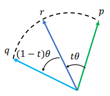
                            - $cos\theta=\textbf{p}\cdot\textbf{q}$ 两个四元数夹角为 $\theta$
                            - 两边乘 $\textbf{p}$: $\textbf{p}\cdot\textbf{r}=a(t)\textbf{p}\cdot\textbf{p} + b(t)\textbf{q}\cdot\textbf{p} \Rightarrow cost\theta=a(t)+b(t)cos\theta$
                            - 两边乘 $\textbf{q}$: $\textbf{q}\cdot\textbf{r}=a(t)\textbf{q}\cdot\textbf{p} + b(t)\textbf{q}\cdot\textbf{q} \Rightarrow cos(1-t)\theta=a(t)cos\theta+b(t)$
                            - 可得
                                - $a(t)=\frac{sin[(1-t)\theta]}{sin\theta}$
                                - $b(t)=\frac{t\theta}{\theta}$
                        - $\textbf{q}_t=\frac{sin[(1-t)\theta]}{sin\theta}\textbf{q}_0+\frac{t\theta}{\theta}\textbf{q}_1$
                        - $cos\theta = \textbf{q}_0\cdot \textbf{q}_1$
            - 对于轴角表示来说，**方便构造**， **方便插值**，**不会有万向锁**，**好应用**

