# GAMES202

[TOC]

## 实时高质量渲染
- 实时：
    - 一般认为30FPS就是实时的
    - 在VR与AR，遇到达到90FPS才是实时
    - 互动性
- 高质量
    - 真实感：利用先进的方法，使得渲染更新加真实
    - 可靠性：一直都是正确的（精确或近似），不容许无法控制的失误
- 渲染
    - 把3D场景通过计算方式模拟光线从光源发射进入虚拟摄像机

### 实时渲染意义
- 如今， 计算机图形学能生成逼真的图像
    - 复杂的几何，照明，材料，阴影
    - 计算机生成的电影、特效已经能做到与真实难以区分
- 但是往往速度和质量不能兼容
    - 比如一些精细的算法、光线追踪等等
    - 实时渲染，尽量与离线渲染效果看起来差不多
### 实时渲染发展史
- 很早期
    - 利用实时渲染
- 20年前
    - 最终幻想7（1997）， 看起来一个个三角形
    - Counter Strike（1999）
- 20到10年前
    - 可编程的渲染管线，给实时渲染带来很大的发展，给程序员带来很大的便利
    - 复杂的照明环境，真实的材料，柔和的阴影
- 如今
    - 实时渲染更多用于了VR、AR
    - 甚至用于部分电影制作

### 重要发展节点
- 20年前，可编程的渲染管线
    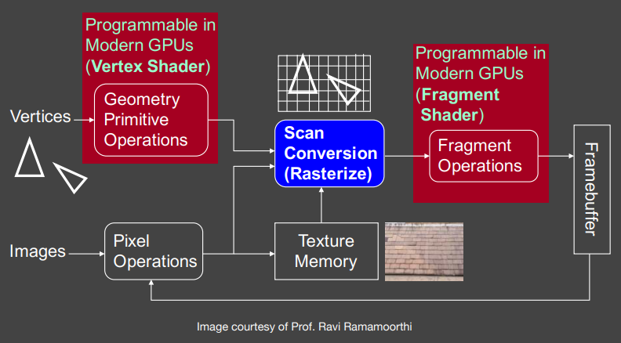</img>
- 15年前，预计算
    - 将一些复杂的视觉部分预先计算存起来
    - 在运行的时候，最小的性能消耗
    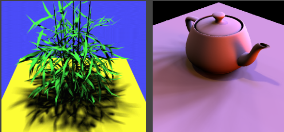</img>
- 8-10年前，交互式光线追踪（CUDA+OptiX）
    - 硬件运行gpu以一个低采样率进行光线追踪（每像素约1采样）
    - 然后再做降噪
    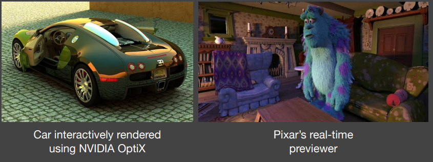</img>

## CG基础回顾
### 基础的GPU渲染管线
- 看101，这里不记
### OpenGL
- API通过CPU来调用GPU管线，因此语言并不重要
- 跨平台的
- 缺点：
    - 碎片化：有很多不同的版本
    - C风格的，不容易使用
    - 早起版本不好调试
- 会一对一对照101中软件光栅化过程
- 重要的类比：油画
    - 放置模型或物体
        - Model specification（什么物体？）
        - Model transformation（什么位置）
        - 用户指定对象定点、法线、纹理坐标，饼将它们作为定点缓存对象（Vertex Buffer Object[VBO]）发生给GPU
        - 使用openGL函数矩阵，例如glTranslate、glMultMatrix。不需要自己写
    - 设置画架的位置
        - View transformation 放置摄像机
            - 设置相机，例如glPerspective
                ``` C++
                void gluPerspective(
                    GLdouble fovy,
                    GLdouble aspect,
                    GLdouble zNear,
                    GLdouble zFar
                )
                ```
        - Create / use a framebuffer 创建画布
    - 把画布贴在画架上
        - 与倒二点合并看
        - 一个OpenGL的渲染通道
            - 指定一个帧缓存使用
            - 指定一个或者多个纹理输出
                - 特殊情况输出到屏幕，但是可能出现撕裂
                - 双缓冲：先渲染到帧缓存上，等确认没问题，再输出到屏幕
            - 渲染：着色器指定每个像素的内容
    - 在画布上作画
        - 怎么样着色
            - 使用定点着色器或者片段着色器
        - 对于每个定点
            - 调用OpenGL定点着色：Transform vertex (ModelView, Projection)
            - 把三角形打成多个像素或者片段
        - 对于每个片段
            - OpenGL调用用户指定的片段着色器：着色与光线计算
            - OpenGL做深度测试，也可以自己做
    - 将其他画布贴在画架上，继续作画（可选）
    - 使用之前的画来用（可选）
- **最关心的: 用户顶底定点和片段着色器**
    - 其他都是封装的
    - 甚至是GUI的
- 总结：
    - 指定对象、相机、MVP等
    - 指定framebuffer和输出/输入纹理
    - 指定顶点/片段着色器
    - 所有内容都在GPU后，渲染！
### OpenGL着色器语言（GLSL）
- 描述定点与片段怎么计算
- 着色语言看起来很像C语言
- 有个很长很丰富的历史
    - 在GPU上写汇编
    - 斯坦福实时着色语言，运行在SGI
    - 来自英伟达的Cg
    - DirectX的HLSH（顶点+像素）
    - OpenGL的GLSL（顶点+片段）
- 着色器配置
    - 初始化
        - 创建着色器（定点和片段）
        - 编译着色器
        - 一个program整合所有的着色器
        - program连接所有着色器
        - 使用program
    - 着色器源也只是字符串序列
    - 跟普通代码的编译步骤相似
- 着色器初始化代码
    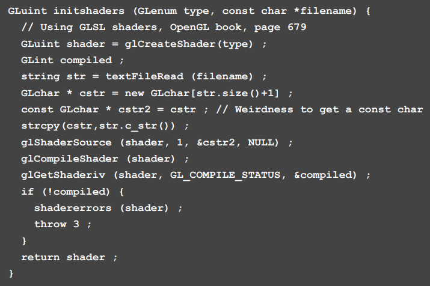</img>
- 着色器连接代码
    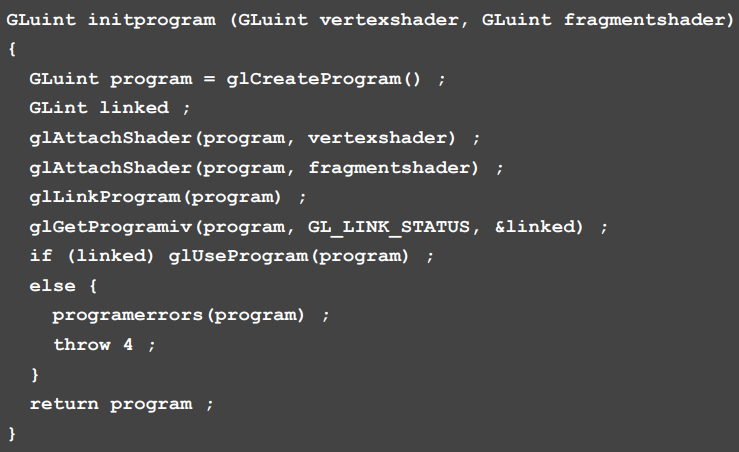</img>
- 调试着色器
    - shader是编译好的，在GPU运行，所以难以调试
    - 几年前, Visual Studio中的NVIDIA Nsight
        - 可以调试GLSL， 但是得多个CPU
        - HLSL,得用软件模拟才能跑
    - 现在
        - Nsight Graphics（跨平台，只支持NVIDIA GPU）
        - RenderDoc （跨平台，对GPU没限制）
        - Spector （WebGL调试）
    - 打印方法
        - 把值提前除于一个值，归一化后，把它当成颜色输出出来
        - 后用类似color picker软件来获取值
### 渲染方程
- 看101，这里不记
### 微积分


## 实时阴影渲染
### 回顾：阴影映射[Shadow Mapping]
- 一个两趟的算法
    - 第一遍：从light的地方看向场景，获取到从light深度最浅（最近）的SM
    - 第二遍：从相机出发，根据从光线出来的的SM去生成场景
- 一个完全在图像空间的算法
    - 优点：SM生成后，不需要实际场景几何
    - 缺点：自遮挡现象、锯齿问题
- 一个家喻户晓的方法
    - 基本的阴影算法
- Shadow Map问题
    - 自遮挡
        - 在每个像素内是一个参数的深度，导致有很多阴影纹路
            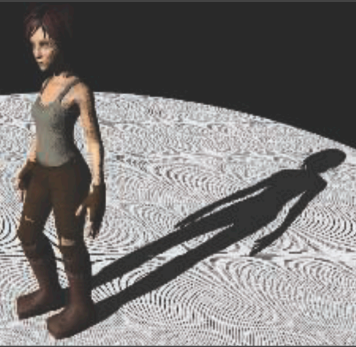</img>
        - 因为形成的shadow map像素是垂直于light的，在第二次看向场景的时候，打向场景的时候，会因为shadow map记录的值更小，导致阴影渲染错误，如图片中橙色部分
            - 光从上往下的时候，不会有问题
            - 光平行于场景的时候，问题会比较严重
        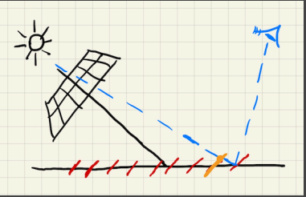</img>
        - 解决
            - 添加偏差来减少自遮挡现象
                - 在一定距离下，不将遮挡阴影进行计算
                - 但是会出现物体接近地面的时候，没有阴影的情况
                - 可以通过光线与物体的角度进行调参，来尽量避免接近底部的物体没有阴影
                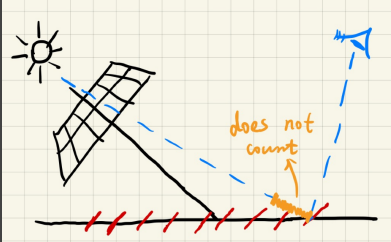</img>
                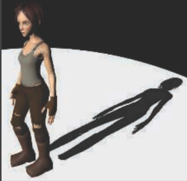</img>
            - 第二深度阴影映射
                - 通过阴影映射的第一深度和第二深度取中间值来做阴影映射
                - 但是，它只能用在watertight的物体（需要有两层的物体，比如纸、地面等等建模一层的都不算）
                - 并且开销并不值得，在实时渲染中，稍微有点复杂的计算都不行。**实时渲染不相信复杂度**
                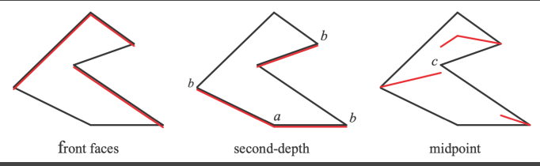</img>
    - 锯齿状
        - 因为分辨率问题，导致阴影会有很严重的锯齿状
        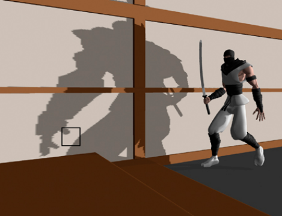</img>
        - 解决
            - cascade shadowmap
                - 不同位置不同分辨率
            - 动态分辨率